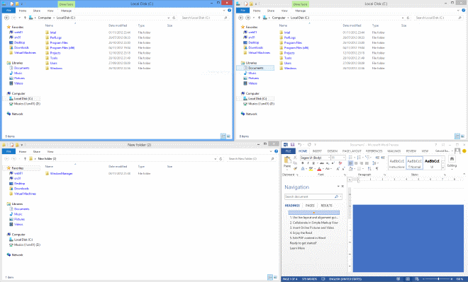
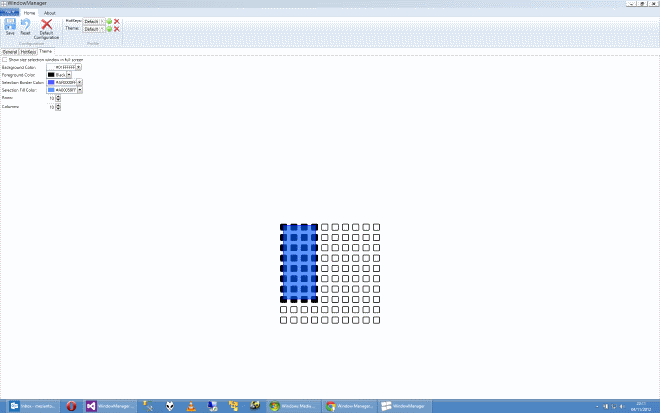
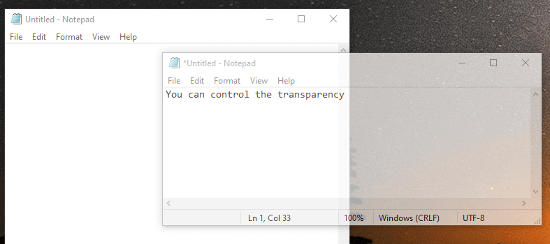
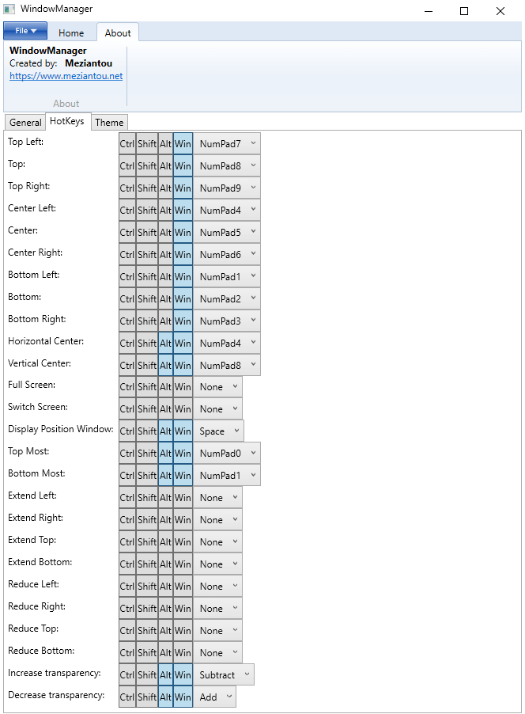

# Window Manager

`Window Manager` allows easy placement of windows. Press <kbd>Windows + NumPad</kbd> to move the active window using the keyboard.
If you need a more specific placement it is possible to use a virtual grid representing the complete screen.
Simply select the desired area in this grid so that the window is moved and resized. Window Manager also allows you to change the transparency of a window and to set it to always stay on top.

It is therefore easy to create the following layout:

Select the zone you want in the virtual grid (<kbd>Windows + Alt + Space</kbd>):

You can change the transparency of a window (<kbd>Windows + Alt + -/+</kbd>):

The hotkeys are fully configurable:

They talked about Window Manager:

- [AddictiveTips - Position Multiple Windows On A Large Screen In Different Sizes](https://www.addictivetips.com/windows-tips/position-multiple-windows-on-a-large-screen-in-different-sizes/)
- [Impress - テンキーで直感的に移動できるウィンドウ配置支援ソフト「Window Manager」](https://forest.watch.impress.co.jp/docs/review/575566.html)
